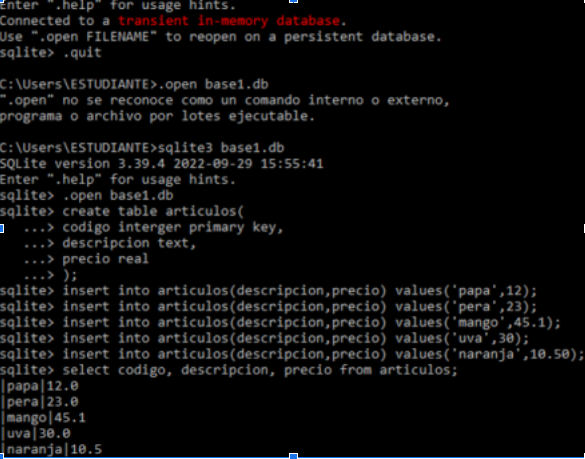
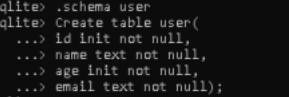
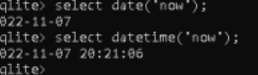
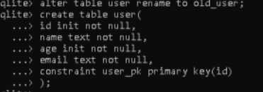
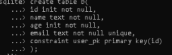
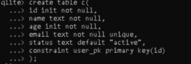
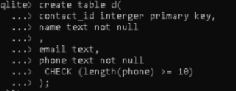
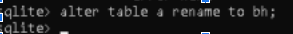
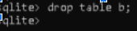
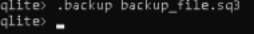

<h1>Ejercicios</h1>

<h2>update </h2>

<h2>estructura de la base de datos .schema </h2>
<h2>date and time functions </h2>

<h2>primary key constraint </h2>

<h2>not null constraint - unique constraint</h2>

<h2>default constraint </h2>

<h2>check constraint </h2>

<h2>alter table</h2>

<h2>delete,drop</h2>

<h2>backup, restore </h2>

